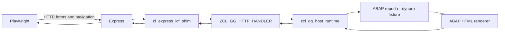

# Real end-to-end HTML host test plan

This plan closes the gap between the Express/ICF transport seam, the
transpiled ABAP runtime, and browser verification. The target is a test in
which Playwright interacts with HTML produced by real ABAP code and every
request returns through the real `zcl_gg_host_runtime` session.

Every checkbox is one reviewable change with an observable result. Do not check
a box until its focused test passes. Keep behavior assertions in ABAP Unit
unless they require an HTTP or browser boundary.

## Non-negotiable constraints

- [x] Define end to end as Playwright or `fetch` -> Express -> ICF shim ->
  ABAP `ZCL_GG_HTTP_HANDLER` -> transpiled `zcl_gg_host_runtime` -> ABAP
  renderer -> HTTP response.
- [x] Do not define HTML strings, page builders, session maps, or transition
  state machines in JavaScript tests.
- [x] Do not inject mocked or synthetic `start`, `dispatch`, or `close`
  callbacks. Callbacks supplied to `createHtmlHostServer` must delegate directly
  to the real ABAP runtime bridge.
- [x] Do not duplicate ABAP business, selection-screen, list-processing,
  dynpro, navigation, validation, or session assertions in JavaScript.
- [x] Keep the JavaScript bridge mechanical: construct ABAP inputs, invoke
  generated methods, and unwrap the public response fields needed by HTTP.
- [x] Use stable semantic locators in Playwright: roles, labels, names, and
  public `data-*` page metadata. Do not select generated layout internals.
- [x] Run every test on an ephemeral port and close browsers, servers, ABAP
  sessions, and database connections in `finally` blocks.
- [x] A browser test must fail if the transpiled ABAP runtime or fixture cannot
  be loaded. It must never fall back to synthetic output.

## Current state and gaps

- `zcl_gg_host_runtime` already owns real session creation, page history,
  request validation, stale-page rejection, dispatch, and close behavior.
- `zif_gg_host_html_v1` already defines the typed request and response records
  shared by the report, dynpro, renderer, and transport boundaries.
- ABAP Unit covers report semantics, selection processing, list interaction,
  dynpro flow, navigation, failures, variants, and runtime round trips.
- `integration/html-http.mjs` exercises the minimal GET/POST/DELETE ABAP
  runtime bridge through the Node HTTP adapter.
- `integration/html-browser.mjs` uses Playwright against the real report and
  dynpro server routes; it does not define HTML or session state.
- `ZCL_GG_HTTP_HANDLER` owns the index, route allow-list, fixture construction,
  request decoding, response status mapping, and lifecycle cleanup in ABAP.
- `host/abap-html-server.mjs` only starts Express and reports the listening
  address.
- The browser script uses the Playwright-managed Chromium installed locally or
  by CI.

## Target architecture

The JavaScript adapter remains transport-only. `ZCL_GG_HTTP_HANDLER` is the
only application boundary that knows both HTTP semantics and the ABAP host
runtime. Test fixtures, expected state transitions, and detailed behavior stay
in ABAP.

## Test ownership

### ABAP Unit

- Report and dynpro fixture behavior.
- Selection validation, defaults, help, and value help.
- List lines, hidden values, action tokens, user commands, PF keys, and back.
- Dynpro PBO, PAI, field transport, cursor context, and screen transitions.
- Session creation, isolation, stale requests, terminal sessions, and close.
- Renderer semantics, escaping, accessibility attributes, and page contracts.
- Error and recovery behavior.

### Node integration

- Loading the transpiled ABAP handler through the ICF shim.
- Minimal HTTP request/response forwarding through the real ABAP handler.
- Proof that requests reach the real ABAP runtime and ABAP-generated responses.

### Playwright

- Browser form serialization and submit-button behavior.
- Accessible discovery and activation of controls.
- Focus, visibility, navigation, and rendered message announcements.
- A small number of representative real workflows across page kinds.
- Two independent browser contexts proving real session isolation.

## 1. Establish real ABAP fixtures

- [x] Choose or add one deterministic report fixture under
  `scaffold/integration/` that starts on a selection page, supports help and
  value help, validates input, and renders a selectable list.
- [x] Ensure a selected list line proves that hidden ABAP values remain on the
  server and are recovered by the opaque action token.
- [x] Choose or add one deterministic dynpro fixture that exercises initial
  PBO, editable input, PAI, help/value help, next-screen navigation, back, and a
  terminal state.
- [x] Reuse `zcl_gg_db_helper` for deterministic data setup and teardown;
  do not seed fixture data in JavaScript.
- [x] Add ABAP Unit tests for every fixture transition before exposing it to
  HTTP.
- [x] Add ABAP Unit runtime tests that perform the exact request sequence later
  used by Playwright and assert structured responses rather than parsed HTML.
- [x] Add ABAP Unit tests for concurrent session isolation, explicit close, and
  deterministic reset.
- [x] Keep browser-only expectations out of these fixture tests.

## 2. Add the transpiled ABAP runtime boundary

- [x] Consume `cl_express_icf_shim` and its minimal `if_http_server`
  implementation from the external `express-icf-shim` transpiler library.
- [x] Add `ZCL_GG_HTTP_HANDLER` implementing `IF_HTTP_EXTENSION`.
- [x] Configure the handler with explicit report and dynpro factories. Do not
  accept arbitrary class names from an HTTP request.
- [x] Initialize and reset integration data through transpiled ABAP fixture
  methods, not JavaScript SQL or duplicated rows.
- [x] Convert JSON and form requests into the generated
  `zif_gg_host_html_v1=>ty_request` shape in ABAP.
- [x] Call `ZCL_GG_HOST_RUNTIME` and write its HTML/error response directly to
  the ICF response entity.
- [x] Forward close and shutdown operations to ABAP so no JavaScript session
  store or fixture registry is introduced.
- [x] Surface generated-runtime exceptions as failed requests with useful test
  diagnostics; never replace them with a successful fallback page.

## 3. Wire a real HTTP server

- [x] Update `host/html-launcher.mjs` to launch the ABAP ICF-backed server.
- [x] Add an executable server entry point that composes Express with the real
  ABAP ICF handler and no test callbacks.
- [x] Keep entry-point selection explicit and allow-listed in ABAP, including
  the report, dynpro, example, and integration routes.
- [x] Start the server on port `0` in tests and return the selected address to
  the caller without parsing console output.
- [x] Make server shutdown close active ABAP sessions and release the database
  connection.
- [x] Keep only socket, Express buffering, and body-limit concerns in
  `host/html-http.mjs`; route parsing, content types, status mapping, and
  response headers are ABAP-owned.
- [x] Ensure `GET` starts a real ABAP session, `POST /dispatch` invokes real
  ABAP dispatch, and `DELETE /session/:id` invokes real ABAP close.
- [x] Add a thin HTTP integration test for the ABAP-generated index, initial
  HTML, JSON dispatch, and session deletion.
- [x] Assert an ABAP-specific fixture value in each successful HTTP response so
  the test cannot pass against a generic adapter stub.

## 4. Replace synthetic integration tests

- [x] Rewrite `integration/html-http.mjs` to use the executable real ABAP host;
  remove local `start` and `dispatch` functions.
- [x] Move detailed session-isolation assertions into ABAP Unit and retain
  browser-context isolation in `integration/html-browser.mjs`.
- [x] Delete JavaScript `Map` session stores from integration tests.
- [x] Delete JavaScript page, form, selection, list, dynpro, and HTML escaping
  helpers from browser tests.
- [x] Remove any test callback that returns `{valid, html}` without invoking
  `ZCL_GG_HOST_RUNTIME`.
- [x] Keep the Node integration test limited to proving the real HTTP bridge;
  detailed behavior remains in ABAP Unit and representative browser flows.
- [x] Move action and state assertions into ABAP Unit when they can be tested
  through `ty_request` and `ty_response` without HTTP.
- [x] Replace `integration/html-snapshots.mjs` digest checks with focused ABAP
  Unit renderer contracts where equivalent coverage exists, then delete the
  script and npm hook if no unique cross-runtime behavior remains.

## 5. Playwright against real ABAP

- [x] Rewrite `integration/html-browser.mjs` to launch the real ABAP-backed
  server in-process and navigate to its ephemeral URL.
- [x] Verify the initial document and page metadata were emitted by the selected
  ABAP fixture.
- [x] Fill a real selection field, submit the form, and assert the resulting
  ABAP list contents.
- [x] Trigger real field help and value help and assert their accessible status
  output.
- [x] Submit invalid input and assert the ABAP validation message, alert role,
  field association, retained value, and focus behavior.
- [x] Activate a real selectable list row and assert the ABAP detail output.
- [x] Verify hidden list values are absent from the DOM while the selected ABAP
  detail proves the server recovered them.
- [x] Exercise a real user command or PF action and assert its ABAP-produced
  result.
- [x] Open a real dynpro session, edit a field, submit PAI, and assert the next
  ABAP screen and value.
- [x] Exercise real dynpro help/value help, back, and terminal behavior.
- [x] Use two isolated browser contexts to prove separate real ABAP sessions do
  not leak values or page history.
- [x] Capture session and page ids from rendered public metadata only; do not
  access ABAP globals from the Playwright test.
- [x] Assert terminal pages expose no actionable form and closed sessions reject
  later dispatch.
- [x] Ensure the Playwright test imports no generated ABAP classes directly;
  all interaction must cross HTTP.

## 6. Browser tooling and CI

- [x] Use a reproducible Playwright browser installation instead of searching
  Windows-specific Chrome paths.
- [x] Put Playwright and other test-only packages in `devDependencies`.
- [x] Add a browser installation step to CI, including Linux system
  dependencies required by Chromium.
- [x] Add a focused `test:html-e2e` npm script that transpiles ABAP before
  starting Playwright.
- [x] Run the real HTTP integration test in the standard `npm test` path.
- [x] Run the real Playwright test in CI on every pull request and push to main,
  either in `npm test` or a dedicated required job.
- [x] Preserve complete server and browser diagnostics on failure while keeping
  successful CI output concise.
- [x] Do not skip browser tests when Chromium is missing; fail setup with an
  actionable installation error.

## 7. Documentation and cleanup

- [x] Document the real bridge and executable server in `README.md` with one
  supported startup command.
- [x] Replace the generic runtime callback example with the concrete ABAP-backed
  composition.
- [x] Document which checks belong to ABAP Unit, Node integration, and
  Playwright.
- [x] Remove claims that synthetic browser or callback tests provide end-to-end
  coverage.
- [x] Remove obsolete npm scripts and files after their real replacements pass.
- [x] Update `scaffold/PLAN3.md` only to point to this plan for the end-to-end
  follow-up; do not rewrite its historical implementation record.

## Verification checklist

- [x] Run `git diff --check`.
- [x] Run `npm run lint`.
- [x] Run `npm run unit`.
- [x] Run the real bridge contract test through the real HTTP integration.
- [x] Run the real HTTP integration test.
- [x] Run the real Playwright test with installed Chromium.
- [ ] Run `npm test` from a clean checkout.
- [ ] Run the CI workflow on Linux without machine-specific browser paths.
- [x] Confirm no integration test defines HTML documents, fake runtime
  callbacks, or a JavaScript session state machine.
- [x] Confirm browser requests invoke `ZCL_GG_HOST_RUNTIME.start`, `dispatch`,
  and `close` by observable ABAP fixture behavior, not implementation spies.

## Definition of done

- [x] Playwright completes selection, validation, help/value help, list,
  line-selection, dynpro, back, and terminal interactions using HTML generated
  by transpiled ABAP.
- [x] HTTP tests exercise the real ABAP runtime and retain only transport-owned
  assertions in JavaScript.
- [x] ABAP Unit owns detailed fixture, runtime, renderer, and state-transition
  coverage.
- [x] No integration or browser test can pass with ABAP output unavailable.
- [x] No mocked callbacks, synthetic pages, duplicated session maps, or
  JavaScript transition models remain in the end-to-end suite.
- [x] Two concurrent browser contexts prove real ABAP session isolation.
- [ ] Real browser coverage runs as a required Linux CI gate.
