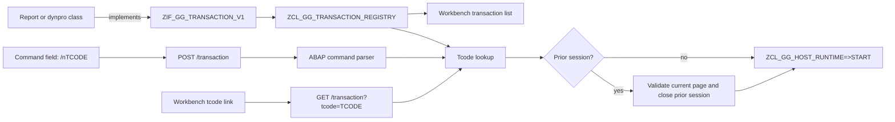

# Transaction-code integration plan

This plan makes transaction codes the public application identity of the HTML
workbench. A runnable class opts in by implementing a small metadata interface
that returns its transaction code and description. One ABAP registry discovers
and validates those implementations; both the workbench list and HTTP command
handling consume that registry.

The target command syntax is `/n<tcode>`. For example, entering
`/nZGG_EX_01` and pressing Enter starts `zcl_gg_ex_01`; entering
`/nZGG_EX_58` starts the dynpro example. When entered from a running
application, `/n` ends that host session before starting the new transaction.

Every checkbox is one reviewable change with an observable result. Do not
check a box until its focused test passes.

## Non-negotiable constraints

- [ ] Keep transaction metadata in the implementing ABAP class. Do not add a
  parallel hard-coded tcode-to-class map in the workbench, HTTP handler,
  JavaScript server, or browser tests.
- [ ] Use one ABAP registry for discovery, normalization, uniqueness checks,
  lookup, list rendering, and launch authorization.
- [ ] A transaction implementation must also implement exactly one supported
  executable contract: `zif_gg_report_v1` or `zif_gg_dynpro_v1`.
- [ ] Treat tcodes case-insensitively and expose their canonical form in upper
  case. Trim surrounding spaces before lookup.
- [ ] Reject initial, over-length, malformed, or duplicate tcodes and initial
  descriptions deterministically; never let discovery order choose a winner.
- [ ] Resolve a tcode to a discovered class on the server. Never accept a class
  name supplied by the command field.
- [ ] Escape transaction codes, descriptions, class names, and error text at
  their HTML text/attribute boundary.
- [ ] Preserve the existing direct class routes during this change so current
  links and tests remain compatible; make tcode routes the workbench-facing
  path.
- [ ] Keep command parsing and lifecycle behavior in ABAP. JavaScript remains
  only the Express/ICF transport adapter.
- [ ] `/n<tcode>` closes the current host session before starting the target;
  an invalid command or unknown tcode must not silently run another class.

## Current state and gaps

- `zcl_gg_workbench` independently discovers `zif_gg_report_v1` and
  `zif_gg_dynpro_v1` implementations and renders their class names.
- Its application tree links directly to `/<class_name>` and therefore has no
  user-facing application name or description.
- `zcl_gg_workbench_utility=>render_commandbar` renders an unnamed, inert text
  input. Enter does not submit it and the HTTP handler has no command route.
- `zcl_gg_http_handler` starts a dynamically created class from a direct path,
  then verifies whether it is a report or dynpro.
- Host sessions can be closed explicitly, but command navigation currently has
  no lifecycle operation that closes one session and starts another.
- Examples 01-57 implement the report contract and example 58 implements the
  dynpro contract; none currently publishes transaction metadata.

## Target architecture



`zif_gg_transaction_v1` is metadata only. It does not replace the report or
dynpro execution interfaces, and it does not know about HTTP. The registry adds
the implementation class name and executable kind to the returned metadata so
callers can render or launch the same validated catalog entry.

## 1. Define the transaction metadata contract

- [ ] Add `scaffold/zif_gg_transaction_v1.intf.abap` as a public, versioned
  interface.
- [ ] Define `ty_tcode` from
  `zif_gg_session_types_v1=>ty_tcode`, a string description, and
  `ty_transaction` containing only `tcode` and `description`.
- [ ] Add a parameterless `get_transaction` method returning
  `ty_transaction`. Metadata retrieval must be side-effect free and must not
  require a host session.
- [ ] Document that the returned tcode is the stable, case-insensitive public
  identifier and that the description is user-facing text.
- [ ] Add an ABAP Unit contract fixture proving one class can implement both
  `zif_gg_transaction_v1` and a runnable report/dynpro interface without
  coupling their callbacks.

Proposed public shape:

```abap
INTERFACE zif_gg_transaction_v1 PUBLIC.
  TYPES ty_tcode TYPE zif_gg_session_types_v1=>ty_tcode.
  TYPES: BEGIN OF ty_transaction,
           tcode       TYPE ty_tcode,
           description TYPE string,
         END OF ty_transaction.

  METHODS get_transaction
    RETURNING
      VALUE(rs_transaction) TYPE ty_transaction.
ENDINTERFACE.
```

## 2. Build one validated transaction registry

- [ ] Add `zcl_gg_transaction_registry` with a public catalog row containing
  canonical tcode, description, implementation class name, and executable
  kind (`REPORT` or `DYNPRO`).
- [ ] Move the XCO, `SEO_INTERFACE_IMPLEM_GET_ALL`, and `reposrc` fallback
  discovery needed for transactions behind this registry. Keep the fallbacks
  compatible with both SAP ABAP and the transpiled runtime.
- [ ] Instantiate each discovered transaction implementation, call
  `get_transaction`, determine its executable interface, normalize the tcode,
  and build the catalog once per process.
- [ ] Validate allowed tcodes as non-initial, no longer than the existing
  `ty_tcode`, and composed of uppercase letters, digits, `_`, and namespace
  `/` separators. Reject whitespace or command prefixes inside metadata.
- [ ] Require a non-initial description after trimming.
- [ ] Reject a transaction class that implements neither or both executable
  interfaces, and report its class name in the diagnostic.
- [ ] Sort catalog output by canonical tcode and detect duplicates after
  normalization. Report both conflicting class names.
- [ ] Expose exact lookup by normalized tcode and catalog enumeration; callers
  must not repeat normalization or inspect repository sources themselves.
- [ ] Expose a test-only cache reset, following the existing workbench/runtime
  reset pattern, so unit tests never depend on execution order.
- [ ] Add ABAP Unit tests for XCO/fallback-independent catalog construction,
  stable sorting, lowercase lookup, surrounding whitespace, every validation
  failure, duplicate rejection, and unknown lookup.

## 3. Add metadata to every example

- [ ] Make `zcl_gg_ex_01` through `zcl_gg_ex_58` implement
  `zif_gg_transaction_v1` and return the mappings below.
- [ ] Keep every mapping beside its example implementation; do not derive the
  tcode from the class name or parse the source comment at runtime.
- [ ] Add one shared inventory test that asserts exactly 58 example tcodes,
  verifies every expected tcode resolves to its class and description, and
  proves no example is omitted. Avoid 58 duplicated browser tests.
- [ ] Retain the current report/dynpro behavior and existing direct routes;
  adding metadata must not change example execution.

| Tcode range | Implementing classes | Description source |
| --- | --- | --- |
| `ZGG_EX_01` ... `ZGG_EX_57` | `ZCL_GG_EX_01` ... `ZCL_GG_EX_57` | The concise `Feature nn` phrase already documented at the top of each class |
| `ZGG_EX_58` | `ZCL_GG_EX_58` | `SET SCREEN, LEAVE SCREEN and LEAVE TO SCREEN` |

Use these exact descriptions for the inventory:

| Tcode | Description |
| --- | --- |
| `ZGG_EX_01` | `WRITE literal` |
| `ZGG_EX_02` | `WRITE AT position and NO-GAP` |
| `ZGG_EX_03` | `SKIP, ULINE, NEW-LINE and SET LEFT COLUMN` |
| `ZGG_EX_04` | `WRITE numeric and mask additions` |
| `ZGG_EX_05` | `FORMAT color and attributes` |
| `ZGG_EX_06` | `WRITE AS CHECKBOX, ICON and SYMBOL` |
| `ZGG_EX_07` | `REPORT line settings` |
| `ZGG_EX_08` | `NEW-PAGE, RESERVE and SET BLANK LINES` |
| `ZGG_EX_09` | `TOP-OF-PAGE` |
| `ZGG_EX_10` | `END-OF-PAGE` |
| `ZGG_EX_11` | `LOAD-OF-PROGRAM` |
| `ZGG_EX_12` | `INITIALIZATION` |
| `ZGG_EX_13` | `START-OF-SELECTION and END-OF-SELECTION` |
| `ZGG_EX_14` | `STOP` |
| `ZGG_EX_15` | `PARAMETERS with DEFAULT` |
| `ZGG_EX_16` | `PARAMETERS attribute additions` |
| `ZGG_EX_17` | `PARAMETERS AS CHECKBOX` |
| `ZGG_EX_18` | `PARAMETERS RADIOBUTTON GROUP` |
| `ZGG_EX_19` | `PARAMETERS AS LISTBOX` |
| `ZGG_EX_20` | `SELECT-OPTIONS` |
| `ZGG_EX_21` | `SELECTION-SCREEN COMMENT, ULINE and SKIP` |
| `ZGG_EX_22` | `Selection-screen block with frame and title` |
| `ZGG_EX_23` | `Selection-screen line and position` |
| `ZGG_EX_24` | `Selection-screen pushbutton and USER-COMMAND` |
| `ZGG_EX_25` | `SELECTION-SCREEN FUNCTION KEY` |
| `ZGG_EX_26` | `Selection-screen tabbed block and tabs` |
| `ZGG_EX_27` | `Selection-screen BEGIN OF SCREEN` |
| `ZGG_EX_28` | `AT SELECTION-SCREEN OUTPUT with LOOP AT SCREEN` |
| `ZGG_EX_29` | `AT SELECTION-SCREEN OUTPUT writing a parameter` |
| `ZGG_EX_30` | `AT SELECTION-SCREEN` |
| `ZGG_EX_31` | `AT SELECTION-SCREEN ON field` |
| `ZGG_EX_32` | `AT SELECTION-SCREEN ON END OF select-option` |
| `ZGG_EX_33` | `AT SELECTION-SCREEN ON BLOCK` |
| `ZGG_EX_34` | `AT SELECTION-SCREEN ON RADIOBUTTON GROUP` |
| `ZGG_EX_35` | `AT SELECTION-SCREEN ON VALUE-REQUEST` |
| `ZGG_EX_36` | `AT SELECTION-SCREEN ON HELP-REQUEST` |
| `ZGG_EX_37` | `AT SELECTION-SCREEN ON EXIT-COMMAND` |
| `ZGG_EX_38` | `SSCRFIELDS-UCOMM driven suppression` |
| `ZGG_EX_39` | `MESSAGE free text TYPE` |
| `ZGG_EX_40` | `MESSAGE number(id) WITH` |
| `ZGG_EX_41` | `Terminal MESSAGE type A` |
| `ZGG_EX_42` | `MESSAGE DISPLAY LIKE` |
| `ZGG_EX_43` | `HIDE and AT LINE-SELECTION` |
| `ZGG_EX_44` | `SET PF-STATUS and AT USER-COMMAND` |
| `ZGG_EX_45` | `SET TITLEBAR` |
| `ZGG_EX_46` | `READ LINE and MODIFY LINE` |
| `ZGG_EX_47` | `GET CURSOR` |
| `ZGG_EX_48` | `TOP-OF-PAGE DURING LINE-SELECTION` |
| `ZGG_EX_49` | `AT PF5` |
| `ZGG_EX_50` | `LEAVE TO/LIST-PROCESSING` |
| `ZGG_EX_51` | `CALL SELECTION-SCREEN` |
| `ZGG_EX_52` | `CALL SCREEN` |
| `ZGG_EX_53` | `Terminal SUBMIT` |
| `ZGG_EX_54` | `SUBMIT AND RETURN with selections and variant` |
| `ZGG_EX_55` | `SUBMIT EXPORTING LIST TO MEMORY` |
| `ZGG_EX_56` | `CALL TRANSACTION` |
| `ZGG_EX_57` | `LEAVE TO TRANSACTION and LEAVE PROGRAM` |
| `ZGG_EX_58` | `SET SCREEN, LEAVE SCREEN and LEAVE TO SCREEN` |

## 4. Render the registry in the workbench

- [ ] Replace the report/dynpro implementation lists in `zcl_gg_workbench`
  with the validated transaction catalog.
- [ ] Render one transaction list sorted by tcode. Each item must show both
  canonical tcode and description, with the tcode as the primary accessible
  link name.
- [ ] Link each item to the canonical launch route
  `/transaction?tcode=<encoded-tcode>`; do not expose the implementation class
  as the destination.
- [ ] Optionally group report and dynpro entries visually using the registry's
  executable kind, while retaining global tcode ordering within each group.
- [ ] Keep `ZCL_GG_DB_HELPER` in a separate Utilities group because it is not a
  transaction and must not implement the metadata interface.
- [ ] Remove transaction-list ownership and report/dynpro caches from
  `zcl_gg_workbench`; the registry is the sole catalog cache.
- [ ] Render a visible, accessible workbench error when a launch link or
  command names an unknown tcode. Preserve the submitted command so it can be
  corrected.
- [ ] Update ABAP Unit workbench tests to assert tcode, description, canonical
  route, ordering, escaping, and the absence of class-name launch links.

## 5. Make `/n<tcode>` executable from the command field

- [ ] Give the command input a stable form field name and place it in a real
  `POST /transaction` form. Pressing Enter must submit without requiring a new
  Go button.
- [ ] Include the active `session_id` and `page_id` as hidden fields when the
  command bar is rendered for a running report or dynpro; omit both on the
  workbench.
- [ ] Add a small ABAP command parser that accepts `/n` case-insensitively,
  permits surrounding whitespace, requires a non-empty tcode immediately
  after `/n`, normalizes it through the registry, and rejects trailing tokens.
- [ ] Keep unsupported commands explicit. Plain `ZGG_EX_01`, `/o...`, `/n`,
  and `/nUNKNOWN` must produce an accessible error rather than navigating.
- [ ] Extend `zcl_gg_http_handler=>handle_post` with the exact
  `/transaction` route. Parse the form in ABAP, resolve the registry entry,
  and construct only the resolved class.
- [ ] Add `GET /transaction?tcode=...` for workbench links. It uses the same
  registry lookup and start helper as POST but does not parse the `/n` prefix.
- [ ] Factor report/dynpro startup out of the direct-class GET branch so direct
  routes and both transaction routes share one typed launch implementation.
- [ ] Add a runtime operation that validates the submitted session/page pair
  against the current page and closes that session atomically. Do not expose
  the runtime's private session table to the HTTP handler.
- [ ] For a valid POST from a running application, use that operation to close
  the supplied current host session, then start the resolved report or dynpro
  and return its initial HTML response.
- [ ] Reject an unknown session or stale page without closing any session. Do
  not call the existing unconditional `close( session_id )` directly from the
  command route.
- [ ] Define failure ordering explicitly: parse and resolve the new tcode
  first; only close the old session once the target is known to be valid and
  runnable. Thus a typo leaves the current application recoverable.
- [ ] Ensure successful `/n` replacement makes the old session reject later
  dispatch while the new response contains a fresh session and page id.
- [ ] Return an appropriate client error for malformed/unknown commands and a
  server error for invalid registry configuration; render both through the
  workbench shell with an `aria-live` or alert message.
- [ ] Add ABAP Unit tests for parsing, canonicalization, report start, dynpro
  start, unknown tcode, malformed command, valid session replacement, stale
  session rejection, and no-session workbench launch.

## 6. Browser and HTTP coverage

- [ ] Update `test/specs/zcl_gg_index.spec.mjs` to verify the workbench lists
  all 58 example tcodes with descriptions and no longer uses class routes for
  transaction entries.
- [ ] Click `ZGG_EX_01` in the list and prove the response is the real ABAP
  report example through the canonical transaction route.
- [ ] Enter `/nZGG_EX_01` on the workbench, press Enter, and prove the report
  starts through the real ABAP HTTP handler.
- [ ] Enter lowercase `/nzgg_ex_58` and prove normalization plus dynpro startup.
- [ ] From one running example, enter `/nZGG_EX_02`; assert a fresh session is
  displayed and an HTTP dispatch using the prior session id is rejected.
- [ ] Enter an unknown and a malformed command; assert the accessible error,
  retained input, absence of unintended transaction startup, and that the
  prior session remains valid.
- [ ] Add focused raw HTTP assertions for GET launch, POST command launch,
  unsupported methods/content, and status codes only where Playwright cannot
  express the transport contract clearly.
- [ ] Keep expected application behavior in existing ABAP Unit/example tests;
  browser tests verify routing, form serialization, focus, accessibility, and
  lifecycle boundaries only.

## 7. Documentation and compatibility cleanup

- [ ] Update `README.md` to make tcodes the documented way to discover and
  start applications, including `/nZGG_EX_01` and `/nZGG_EX_58` examples.
- [ ] Document how a new report or dynpro opts into the workbench by
  implementing `zif_gg_transaction_v1` and returning unique metadata.
- [ ] Document that direct `/<class_name>` routes are compatibility/debug
  routes and are not the public transaction identity.
- [ ] Update `GUI_HTML_CAPABILITIES.md` with command-field syntax, supported
  navigation semantics, unknown-command behavior, and session replacement.
- [ ] Remove obsolete workbench report/dynpro discovery code only after the
  registry-backed list and compatibility routes pass.

## Verification checklist

- [ ] Run `git diff --check`.
- [ ] Run `npm run lint`.
- [ ] Run `npm run unit`.
- [ ] Run `npm run test:html-e2e` with Chromium installed.
- [ ] Confirm the registry contains exactly 58 `ZGG_EX_*` transactions and
  each class implements exactly one executable interface.
- [ ] Confirm tcodes and descriptions appear only in their implementing
  classes plus the test inventory/plan, not in a production central map.
- [ ] Confirm an unknown tcode cannot instantiate an arbitrary ABAP class.
- [ ] Confirm `/n` replacement closes the old session only after successful
  parse and lookup.
- [ ] Confirm all dynamic transaction text is escaped and every failure is
  keyboard- and screen-reader-accessible.

## Definition of done

- [ ] Every example publishes the specified tcode and description through
  `zif_gg_transaction_v1`.
- [ ] The workbench lists the validated transaction catalog using tcode and
  description and launches entries through a tcode route.
- [ ] `/n<tcode>` entered on either the workbench or a running application
  starts the matching report or dynpro.
- [ ] Starting a valid `/n` transaction replaces and closes the prior host
  session without leaking state.
- [ ] Invalid, unknown, duplicate, or unsafe metadata and commands fail
  deterministically without arbitrary class creation.
- [ ] ABAP Unit owns registry, parser, resolution, and lifecycle behavior;
  Playwright proves the real command field and HTTP boundary end to end.
