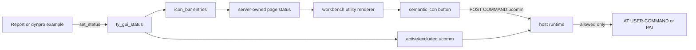

# Example-owned application icon bar plan

This plan makes the executable example the sole owner of the application icon
bar shown while that example is running. The workbench, HTML renderer, HTTP
handler, and JavaScript transport must not invent application buttons or carry
a second icon-bar definition.

The current five-button workbench bar (`Create`, `Open`, `Add to favorites`,
`Edit`, and `Refresh`) is presentation-only and has no application command
semantics. It must be removed rather than silently inherited by every example.
An example that wants buttons defines them in its runtime GUI status.

Every checkbox is one reviewable change with an observable result. Do not
check a box until its focused test passes.

## Non-negotiable constraints

- [x] Keep the public definitions of `cl_gui_control` and `cl_gui_selector`
  unchanged; host-only typed surface and selector helpers belong in separate
  classes.
- [x] The running report or dynpro is the only source of its application icon
  bar, through `zif_gg_session_types_v1=>ty_gui_status-icon_bar`.
- [x] Do not add icon metadata to `zif_gg_transaction_v1`. Transaction metadata
  is static discovery data; an icon bar is runtime state that may change between
  pages and PBO/PAI cycles.
- [x] Do not add a tcode-, class-, route-, or example-number-to-icon map in the
  workbench, renderer, HTTP handler, JavaScript adapter, or browser tests.
- [x] `zcl_gg_workbench_utility` renders the supplied status but does not choose
  buttons, commands, labels, ordering, or enablement for an application.
- [x] An icon-bar entry does not authorize its function code. Its `ucomm` must
  also be present in `active_ucomm` and absent from `excluded_ucomm`; the HTML
  runtime repeats that check server-side before dispatch.
- [x] Preserve entry order and separators exactly as supplied by the example.
- [x] Escape labels and function codes at their HTML boundaries and resolve
  icons only through `zcl_gg_host_icons`; never accept raw SVG or HTML from an
  example.
- [x] An example with an initial icon bar renders no application toolbar
  buttons. There is no default or fallback button set.
- [x] Keep the standard command bar separate. Back, Save, Exit, paging, and the
  other standard commands continue to follow the existing CUA-status rules.

## Current state and gaps

- `zcl_gg_workbench=>render_workbench` passes a hard-coded five-entry
  `it_icon_bar` to `zcl_gg_workbench_utility=>render_top`.
- `render_top` currently has two possible icon-bar owners: explicit
  `it_icon_bar`, then `is_status-icon_bar` as a fallback. This precedence rule
  permits host code to replace application state.
- `zcl_gg_ex_044` already demonstrates the desired runtime mechanism by setting
  `status-icon_bar` to `Refresh` and `Print`, with the corresponding commands in
  `active_ucomm`.
- Most examples intentionally define no icon bar. They should remain empty and
  must not inherit workbench buttons.
- The renderer already emits semantic buttons and uses the shared icon sprite,
  but its tests still exercise the host-supplied `it_icon_bar` path.
- Browser tests currently assert and click the hard-coded workbench icons, so
  they encode the ownership bug.

## Target flow

The page snapshot is the transport boundary. HTML and JavaScript never infer
buttons from a transaction code or class name, and a submitted function code is
accepted only when the current server-owned page status authorizes it.

## 1. Make ownership unambiguous

- [x] Remove `it_icon_bar` from `zcl_gg_workbench_utility=>render_top` and all
  callers. `is_status-icon_bar` becomes the only input.
- [x] Remove the local `lt_icon_bar` precedence/fallback logic from
  `render_top`.
- [x] Remove the hard-coded `Create`, `Open`, `Add to favorites`, `Edit`, and
  `Refresh` entries from `zcl_gg_workbench`.
- [x] Render the workbench index with an initial GUI status and therefore no
  application icon buttons.
- [x] Keep `render_iconbar` private and purely presentational; it must not query
  the transaction registry, inspect an executable class, or manufacture
  defaults.
- [x] Add an ABAP Unit test proving an initial status produces no application
  icon buttons and no fallback labels.

## 2. Pin the example contract

- [x] Keep `ty_icon_bar_item` as the versioned runtime contract containing
  `ucomm`, `label`, `icon`, and `separator`.
- [x] Document that every actionable entry supplies a non-initial `ucomm`, a
  user-facing label, and an icon name from the host icon catalog.
- [x] Define separator behavior precisely: `separator = abap_true` inserts a
  separator immediately before that entry and does not create a standalone
  action.
- [x] Define duplicate `ucomm` behavior. Prefer rejecting duplicates in one
  status snapshot rather than rendering ambiguous controls.
- [x] Define unknown icon behavior deterministically through
  `zcl_gg_host_icons` and cover it without allowing example-provided markup.
- [x] Add validation close to page/status construction so malformed entries
  fail before rendering, with the owning example named in diagnostics where
  available.

## 3. Use `zcl_gg_ex_044` as the canonical example

- [x] Keep icon-bar definition beside `SET PF-STATUS` in `zcl_gg_ex_044`; do not
  move it to the workbench or a shared example helper.
- [x] Retain the ordered `Refresh` and `Print` entries, including the separator
  before `Print`.
- [x] Keep both `REFR` and `PRI` in `active_ucomm` so the rendered buttons and
  server-side authorization agree.
- [x] Keep `DEL` active-but-excluded as the negative authorization fixture; it
  must not become an enabled icon-bar action.
- [x] Extend the example's ABAP Unit test to assert the complete icon-bar model:
  entry count, order, labels, icon names, function codes, and separator.
- [x] Add a second fixture assertion using an example with no status icon bar,
  proving it receives no inherited buttons.

## 4. Render only example-supplied entries

- [x] Render one semantic `button` per supplied actionable entry, in source
  order, using its label as accessible name and tooltip.
- [x] Submit `COMMAND:<ucomm>` only for entries authorized by the current
  `active_ucomm`/`excluded_ucomm` status.
- [x] Render an inactive or excluded example entry disabled and without a
  dispatchable form value.
- [x] Omit the application toolbar region when the icon bar is initial, unless
  layout verification proves an empty structural region is required; choose
  one behavior and pin it with an accessibility test.
- [x] Preserve responsive layout, focus visibility, pressed-state feedback,
  and separator styling for example-defined buttons.
- [x] Add escaping tests for quotes, ampersands, angle brackets, and Unicode in
  labels and function codes.
- [x] Add a renderer test proving unknown icon input cannot inject SVG, HTML,
  URLs, or script.

## 5. Enforce the same model at dispatch

- [x] Keep the current runtime rule that `COMMAND` requires an active and
  non-excluded function code from the current server-owned page.
- [x] Add a focused test proving an icon entry without matching
  `active_ucomm` is disabled in HTML and rejected when forged over HTTP.
- [x] Add a focused test proving an excluded icon command remains rejected even
  when the command also appears in `active_ucomm`.
- [x] Prove a permitted example icon command reaches `AT USER-COMMAND` and
  produces the expected next page.
- [x] Prove rejection does not advance the page id, mutate example state, or
  make the original page stale.
- [x] Keep authorization in ABAP; JavaScript must only serialize the clicked
  button and forward the request.

## 6. Update browser and HTTP coverage

- [x] Update the workbench index spec to assert that the five hard-coded icon
  buttons are absent.
- [x] Open an example without an icon bar and assert that no application icon
  buttons appear.
- [x] Open `ZGG_EX_044` and assert that exactly `Refresh` and `Print` appear in
  the declared order with the declared icons and separator.
- [x] Click `Refresh` and prove the real ABAP `AT USER-COMMAND` callback renders
  `refreshed`.
- [x] Click `Print` and prove the standard `PRI` command renders `printed`.
- [x] Send forged inactive and excluded icon commands through `/dispatch` and
  assert a client error while the current session/page remains valid.
- [x] Keep detailed model and authorization behavior in ABAP Unit; browser
  tests own only rendering, accessibility, form serialization, and the real
  HTTP boundary.

## 7. Documentation and cleanup

- [x] Update `GUI_HTML_CAPABILITIES.md` to state that the executable status is
  the sole application icon-bar owner.
- [x] Add a concise README example showing `set_status` with `icon_bar`,
  `active_ucomm`, and the matching callback.
- [x] Remove documentation and tests that describe the workbench's five static
  buttons as application behavior.
- [x] Search production code for `it_icon_bar`, hard-coded launchpad button
  labels, and icon-bar defaults; no second production owner may remain.
- [x] Record any transpiler or SAP-runtime blocker in `ANORMALIES.md` and keep
  its affected checkbox open.

## Verification checklist

- [x] Run focused ABAP Unit tests for the status model, renderer, workbench
  utility, runtime authorization, and example 044.
- [x] Run `npm run lint`.
- [x] Run `npm run unit`.
- [x] Run `npm run test:html-e2e` with Chromium installed.
- [ ] Run `npm test` from a clean checkout.
- [ ] Run `git diff --check` from a line-ending-clean worktree.
- [ ] Confirm the Linux CI workflow passes the real browser suite.

## Definition of done

- [x] No workbench, renderer, HTTP, or JavaScript code defines application icon
  buttons for an executable example.
- [x] The current example page status is the sole icon-bar source and survives
  report and dynpro page transitions correctly.
- [x] Examples with no icon bar show no inherited or fallback buttons.
- [x] Example-defined ordering, labels, icons, separators, and enablement render
  accessibly and deterministically.
- [x] Forged inactive or excluded icon commands are rejected server-side
  without changing session state.
- [x] ABAP Unit owns model and authorization behavior, and Playwright proves the
  example-defined icon bar through the real HTTP boundary.
